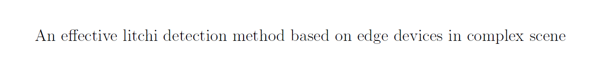

# INTRODUCTION:
This ia a repo about litchi detection model based on yolov3-spp network, the model has been processed by channel and layer pruning algorithms. Finally, the size of the model was reduced from 240M to only *7M*, but the average precision and average recall reached *95.3%* and *97.3%*, respectively.

# TEST
In this study, the whole experiments were completed on Nvidia DGX-1, an image deep 210 learning training platform deployed with 8 Tesla P100 16GB GPU processors. Before testing, you must install the necessary dependency libraries as required by the model.The test set can be obtained from the‘data/val/', and the final model can be found in the fold "weights". 

you can test the model performence by using the following command:
python test.py --cfg cfg/prune_12_shortcut_prune_0.9_keep_0.01_yolov3-spp.cfg --data data/litchi.data --weights weights/last.pt --batch-size 32 --save-json --device 0 

